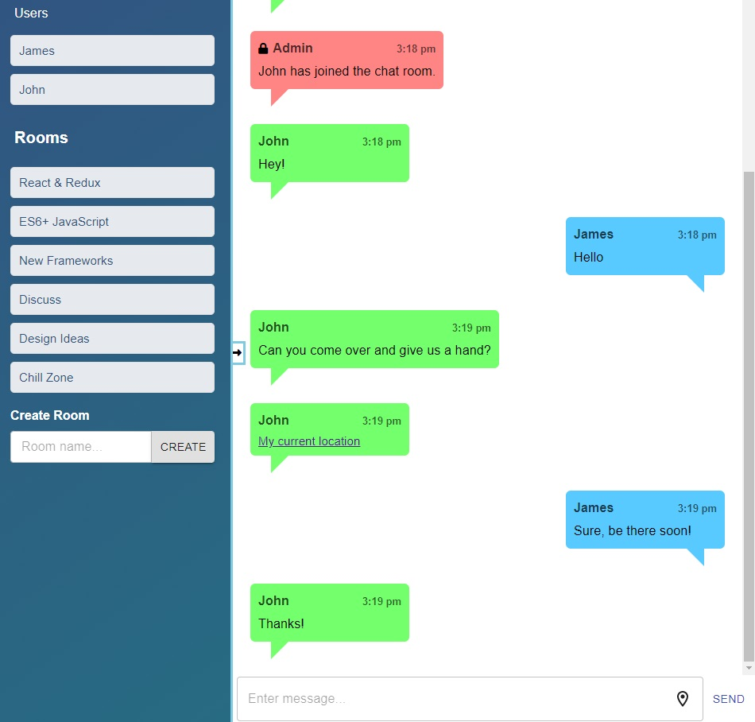

# Chatter

## Table of Contents
  - [General Information](#general-information)
  - [Installation](#installation)
  - [Usage](#usage)
  - [Join a Room](#joining-a-room)
  - [Chat Features](#chat-features)
  - [Technologies](#technologies)
  - [Status](#status)
  - [Todo](#todo)

## General Information

Chatter is a chat application which was built to bring developers together in 
discussing the latest technologies used in the JavaScript world. 
There are many chat rooms to choose from, such as React & Redux, ES6+ JavaScript, 
New Frameworks, Discuss, Design Ideas & finally a Chill Zone. 
You can also create an unlimited amount of rooms by using the textbox provided, 
and getting your peers to join the same room!
## Installation

If you are looking to view/make changes to the existing codebase, then cloning the repository is the best way to achieve this. 

To do this navigate to a suitable directory, and run `git clone https://github.com/jamesgower/chatter.git` from the terminal. 

Once the repository is cloned, you can navigate to the repository and run `npm install` to install all of the dependencies. To run the application, you can run `npm run dev` from the root directory, and a local version of the can be accessed from accessing localhost:8080 from your browser.

## Usage

To use the application, it can be accessed from 
[this](https://node-chatter-app.herokuapp.com/) link (https://node-chatter-app.herokuapp.com/), or by installing it with the above method.

### Joining a Room

When the application is opened you will be greeted with a form where you must choose a display name and a room name. Both of these fields need to be completed to enter a chat room. The display name should be a unique one to differentiate between yourself and others, otherwise the name will be edited to force this. To join a room you can either choose one of the predefined ones, or input one in the input field, and click the blue join button.

### Chat Features

All of the chat rooms have the same features and functionality, such as being able to send messages to all people in the room, and also to be able to send your current location to everybody in the room. Both actions can be achieved by clicking the respective button in the bottom right of the application, next to the text box.

Pressing the "Send Location" button will send a link to all others in the chat room which can be clicked to open up a Google Maps view of your current location. It does this by using the users' longitude and latitude, which will only work if the user allows location tracking features in the browser. Older browsers such as Internet Explorer may not allow these features to work properly.

## Technologies

- React
- Redux
- TypeScript
- Material UI (MUI)
- Socket.IO-Client
- WebSockets
- Express (Node.js)
- Axios
- Socket.IO

## Status

The application is in a working state, but there are features which need to be implemented to be considered a finished product. Updates will be made in due course.

## Todo

Testing needs to be refactored and uploaded since refactoring and upgrading the application.
